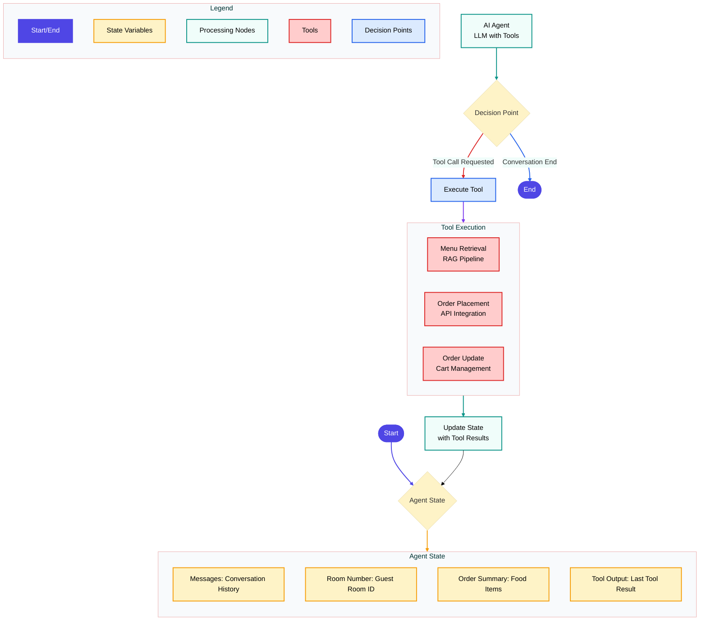

```mermaid
%%{init: {'theme': 'base', 'themeVariables': { 'primaryColor': '#FEF3C7', 'secondaryColor': '#F0FDFA', 'tertiaryColor': '#FFCCCC', 'clusterBkg': '#F8FAFC'}}}%%
graph TD
    %% Define styles %%
    classDef startEnd fill:#4F46E5,stroke:#4F46E5,color:#FFF,stroke-width:2px;
    classDef state fill:#FEF3C7,stroke:#F59E0B,color:#000,stroke-width:2px;
    classDef process fill:#F0FDFA,stroke:#0D9488,color:#000,stroke-width:2px;
    classDef tool fill:#FFCCCC,stroke:#DC2626,color:#000,stroke-width:2px;
    classDef decision fill:#DBEAFE,stroke:#2563EB,color:#000,stroke-width:2px;
    
    %% Start point %%
    A([Start]):::startEnd --> B{Agent State}
    
    %% Main agent state with sub-states %%
    subgraph B2[Agent State]
        direction TB
        B2A[Messages: Conversation History]:::state
        B2B[Room Number: Guest Room ID]:::state
        B2C[Order Summary: Food Items]:::state
        B2D[Tool Output: Last Tool Result]:::state
    end
    
    B --> B2
    
    %% Agent processing %%
    C[AI Agent<br/>LLM with Tools]:::process --> D{Decision Point}
    
    %% Decision outcomes %%
    D -->|Tool Call Requested| E[Execute Tool]:::decision
    D -->|Conversation End| F([End]):::startEnd
    
    %% Tool execution with specific tools %%
    subgraph E2[Tool Execution]
        direction LR
        E2A[Menu Retrieval<br/>RAG Pipeline]:::tool
        E2B[Order Placement<br/>API Integration]:::tool
        E2C[Order Update<br/>Cart Management]:::tool
    end
    
    E --> E2
    
    %% Tool results back to agent %%
    E2 --> G[Update State<br/>with Tool Results]:::process
    
    %% Loop back to agent state %%
    G --> B
    
    %% Styling connections %%
    linkStyle 0 stroke:#4F46E5,stroke-width:2px;
    linkStyle 1 stroke:#F59E0B,stroke-width:2px;
    linkStyle 2 stroke:#0D9488,stroke-width:2px;
    linkStyle 3 stroke:#DC2626,stroke-width:2px;
    linkStyle 4 stroke:#2563EB,stroke-width:2px;
    linkStyle 5 stroke:#7C3AED,stroke-width:2px;
    linkStyle 6 stroke:#0D9488,stroke-width:2px;
    
    %% Legend
    subgraph Legend[Legend]
        direction TB
        L1[Start/End]:::startEnd
        L2[State Variables]:::state
        L3[Processing Nodes]:::process
        L4[Tools]:::tool
        L5[Decision Points]:::decision
    end
```