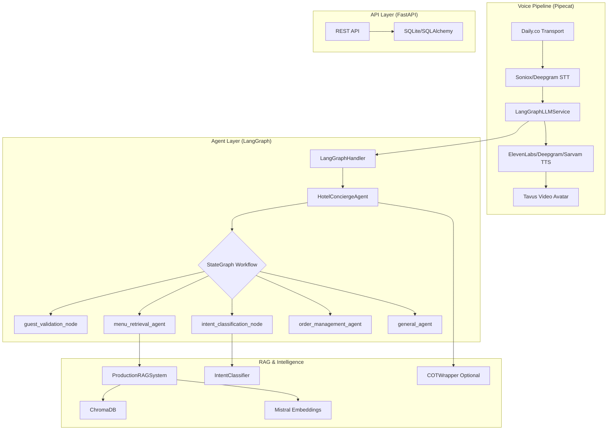
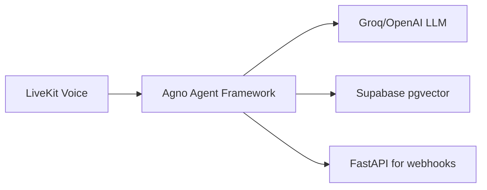

# Grand Plaza Backend Architecture Review (V2)

> **Document Author**: AI Architectural Analysis  
> **Last Updated**: January 14, 2026  
> **Main Entry Point**: [`hotel_concierge_langgraph.py`](file:///Users/prada/Coding/grand-plaza-monorepo/backend/hotel_concierge_langgraph.py)

---

## Executive Summary

The current backend is a **voice-first AI concierge system** for hotel room service, built on a sophisticated multi-component stack. While architecturally interesting, it exhibits **over-engineering** concerns, **high coupling**, and **maintenance complexity** that warrant consideration of alternatives for V2.

### Verdict: ⚠️ **Viable but Fragile**

The system works but has scaling limitations, tight coupling, and operational complexity that could be simplified significantly.

---

## Current Architecture Overview



---

## Dependency Map from Entry Point

| File | Purpose | Critical Dependencies |
|------|---------|----------------------|
| [`hotel_concierge_langgraph.py`](file:///Users/prada/Coding/grand-plaza-monorepo/backend/hotel_concierge_langgraph.py) | Main entry point, voice pipeline orchestration | pipecat, Daily.co, main_langgraph_agent |
| [`main_langgraph_agent.py`](file:///Users/prada/Coding/grand-plaza-monorepo/backend/main_langgraph_agent.py) | LangGraph agent with StateGraph workflow | langgraph, langchain, production_rag_system |
| [`production_rag_system.py`](file:///Users/prada/Coding/grand-plaza-monorepo/backend/production_rag_system.py) | Unified RAG system facade | rag_pipeline_refactored, intent_classifier_refactored |
| [`rag_pipeline.py`](file:///Users/prada/Coding/grand-plaza-monorepo/backend/rag_pipeline.py) | ChromaDB + Mistral embeddings RAG | langchain, chromadb, mistralai |
| [`cot_reasoning.py`](file:///Users/prada/Coding/grand-plaza-monorepo/backend/cot_reasoning.py) | Chain-of-Thought reasoning wrapper | langchain_groq, langchain_openai |
| [`elevenlabs_fix.py`](file:///Users/prada/Coding/grand-plaza-monorepo/backend/elevenlabs_fix.py) | Multi-tier TTS fallback system | elevenlabs, deepgram, sarvam |
| [`session_transcript_logger.py`](file:///Users/prada/Coding/grand-plaza-monorepo/backend/session_transcript_logger.py) | CSV-based conversation logging | stdlib only |

---

## Strengths of Current Architecture

### ✅ What Works Well

1. **State Machine Design**: LangGraph's `StateGraph` provides clear conversation flow with explicit routing functions (`route_after_guest_validation`, `route_after_intent_classification`)

2. **Production RAG System**: Unified facade pattern via `ProductionRAGSystem` abstracts RAG complexity well

3. **Multi-tier TTS Fallback**: `RobustElevenLabsTTS` implements resilient fallback (ElevenLabs → Deepgram → Sarvam)

4. **LangSmith Integration**: Comprehensive `@traceable` decorators enable observability

5. **Separation of Concerns**: Specialized agents for menu, orders, and general queries

---

## Weaknesses & Concerns

### 🔴 Critical Issues

| Issue | Impact | Location |
|-------|--------|----------|
| **145+ Python Dependencies** | Deployment complexity, version conflicts | [`requirements-full.txt`](file:///Users/prada/Coding/grand-plaza-monorepo/backend/requirements-full.txt) |
| **Tight Pipecat Coupling** | Locked to Pipecat's async model | `hotel_concierge_langgraph.py` |
| **Multiple RAG Iterations** | Confusion between `rag_pipeline.py` and `rag_pipeline_refactored.py` | Backend root |
| **SQLite in Production** | Not scalable for concurrent users | [`database.py`](file:///Users/prada/Coding/grand-plaza-monorepo/backend/app/database.py) |
| **Hardcoded Webhook** | Order placement relies on external webhook | `main_langgraph_agent.py:154` |

### 🟡 Architectural Debt

1. **Over-abstraction**: `get_production_rag_system()` → `create_rag_manager()` → `MenuRAGPipeline` → ChromaDB is 4 layers deep

2. **Duplicate Intent Systems**: `intent_classifier_refactored.py` AND `semantic_intent_classifier.py` both exist

3. **COT Optional but Wired**: `cot_reasoning.py` is conditionally loaded but baked into agent logic

4. **No Container Orchestration**: Single `docker-compose.yml` service, no scaling strategy

---

## Alternative Stack Recommendations

### Option 1: **Agno + LiveKit (Recommended)**

> [!TIP]  
> Best for: Simplification, better voice handling, modern agentic patterns



**Why Agno?**
- **Native async voice support** with LiveKit integration
- **Coordinator mode** for multi-agent orchestration (you were researching this!)
- **Simpler state management** than LangGraph's explicit routing
- **Built-in tool calling** without custom tool classes

**Migration Effort**: 🟡 Medium (2-3 weeks)

---

### Option 2: **Livekit Agents SDK + LangGraph (Incremental)**

> [!NOTE]  
> Best for: Keeping LangGraph investment, better voice transport

Replace Pipecat with LiveKit Agents SDK while keeping LangGraph:

| Replace | With |
|---------|------|
| Pipecat + Daily.co | LiveKit Agents SDK |
| Custom `LangGraphLLMService` | LiveKit's native LLM integration |
| `elevenlabs_fix.py` | LiveKit's TTS plugins |

**Migration Effort**: 🟢 Low (1 week)

---

### Option 3: **Vercel AI SDK + Hono (Full Rebuild)**

> [!CAUTION]  
> Only if switching to TypeScript is acceptable

For a cleaner, production-grade system:

- **Vercel AI SDK** for streaming, tool calling, structured outputs
- **Hono** for edge-ready API server
- **pgvector on Supabase** for RAG
- **Deepgram/ElevenLabs SDKs** directly

**Migration Effort**: 🔴 High (4-6 weeks)

---

## RAG Pipeline Iterations Analysis

The codebase has **multiple RAG implementations**:

| File | Status | Notes |
|------|--------|-------|
| `rag_pipeline.py` | 🟡 Legacy | 634 lines, multi-strategy retrieval |
| `rag_pipeline_refactored.py` | ✅ Current | Cleaner, used by `production_rag_system.py` |
| `production_rag_system.py` | ✅ Active | Facade combining RAG + Intent |
| `semantic_cache.py` | 🟡 Unused? | Caching layer, unclear if active |
| `query_expansion.py` | 🟡 Complex | 14K+ bytes of query expansion logic |
| `query_expansion_simplified.py` | ✅ Simpler | 10K bytes, likely the active version |

> [!IMPORTANT]  
> **Recommendation**: Delete `rag_pipeline.py`, `query_expansion.py`, and consolidate to single RAG module.

---

## Database Architecture Concerns

Current: **SQLite** with SQLAlchemy ORM

```python
# backend/app/database.py
DATABASE_URL = os.getenv("DATABASE_URL", "sqlite:///./hotel_concierge.db")
```

### Issues:
- SQLite doesn't support concurrent writes well
- No vector search for hybrid RAG
- Separate ChromaDB instance needed for embeddings

### Recommended Migration:

```
PostgreSQL + pgvector on Supabase
├── guests, orders, voice_sessions (transactional)
└── menu_embeddings (vector search)
```

**Benefits**:
- Single database for all data
- Native vector similarity search
- Supabase provides auth, realtime, edge functions

---

## Operational Complexity Score

| Aspect | Current | With Agno | With LiveKit Only |
|--------|---------|-----------|-------------------|
| Dependencies | 145+ pkgs | ~40 pkgs | ~60 pkgs |
| External APIs | 8+ (Daily, Deepgram, ElevenLabs, Groq, Mistral, LangSmith, Sarvam, webhook) | 4 (LiveKit, LLM, Supabase, LangSmith) | 6 |
| Deployment | Docker + nginx | Docker | Docker |
| Debug Surface | Very Large | Moderate | Moderate |

---

## Specific Refactoring Recommendations

### Immediate (This Sprint)

1. **Delete unused files**:
   - `rag_pipeline.py` (use `rag_pipeline_refactored.py`)
   - `langgraph_agent.py` (use `main_langgraph_agent.py`)
   - `semantic_intent_classifier.py` (use `intent_classifier_refactored.py`)

2. **Consolidate requirements**:
   ```bash
   uv pip compile requirements-full.txt -o requirements.lock
   ```

3. **Environment validation**: Add startup check for all 15+ required env vars

### Short-term (Next 2 Weeks)

1. **Migrate SQLite → PostgreSQL** (Supabase)
2. **Replace ChromaDB with pgvector** for unified data layer
3. **Abstract voice transport**: Create interface for Pipecat → LiveKit swap

### Medium-term (1-2 Months)

1. **Evaluate Agno Coordinator Mode** for multi-agent orchestration
2. **Add rate limiting** to FastAPI endpoints
3. **Implement proper auth** (JWT, not just room number validation)

---

## Summary Matrix

| Criteria | Current Stack | Agno + LiveKit | LiveKit + LangGraph | Vercel AI + Hono |
|----------|---------------|----------------|---------------------|------------------|
| Voice Quality | ⭐⭐⭐⭐ | ⭐⭐⭐⭐⭐ | ⭐⭐⭐⭐⭐ | ⭐⭐⭐ |
| Maintainability | ⭐⭐ | ⭐⭐⭐⭐ | ⭐⭐⭐ | ⭐⭐⭐⭐⭐ |
| Dependency Count | ⭐ | ⭐⭐⭐⭐ | ⭐⭐⭐ | ⭐⭐⭐⭐⭐ |
| Learning Curve | ⭐⭐ | ⭐⭐⭐ | ⭐⭐⭐⭐ | ⭐⭐⭐ |
| Migration Effort | N/A | 🟡 Medium | 🟢 Low | 🔴 High |

---

## Final Opinion

> [!IMPORTANT]  
> The current architecture is **working but over-engineered**. For V2, I recommend **Option 2 (LiveKit Agents + LangGraph)** as an incremental improvement, with **Option 1 (Agno)** being the strategic target if you want simplified multi-agent orchestration.

The immediate priority should be **cleanup**: delete duplicate files, consolidate RAG implementations, and migrate to PostgreSQL. This alone will reduce cognitive load significantly.

---

*This document is intentionally opinionated. The working V1 in `hotel_concierge_langgraph.py` proves the architecture is viable—this analysis is about what could be better for scale and maintenance.*
